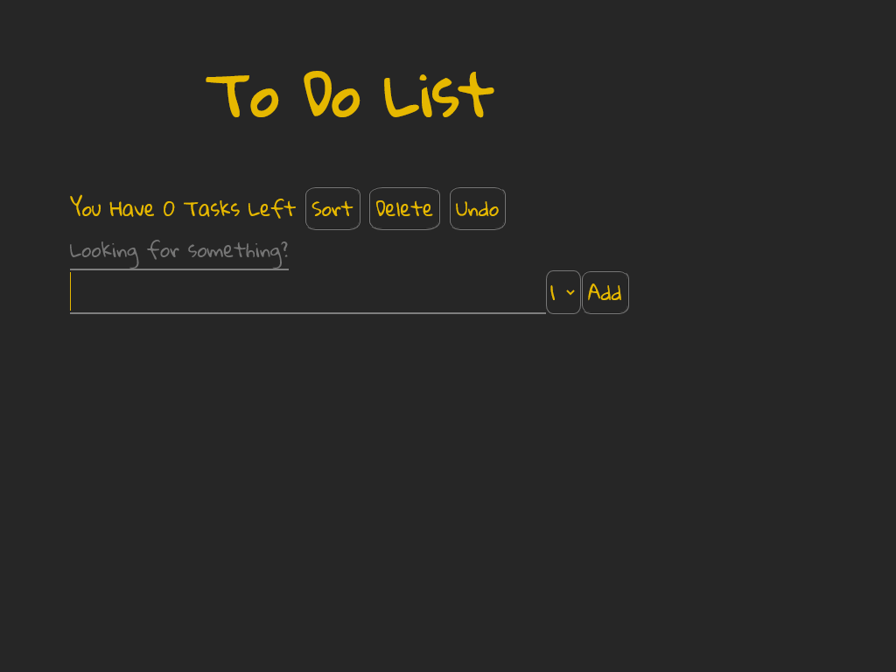
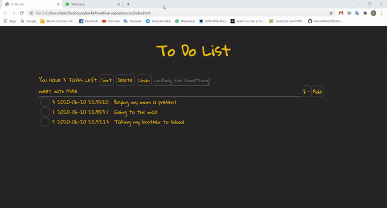

#    Pre Course Project - Todo List
This project will include most of the topics we have learnt so far.
This repository includes a basic skeleton with automated tests, use it for you submissions.
In this project you will create a Todo List Web Application, in which the user can store prioritized _todo tasks_ and view/sort that list


Goal (only functionality):


## Instructions
 - Create Github user
 - Go [here](https://github.com/new/import) and import this repository into your account. Make sure to select the private option
 - Clone your new repository to your computer
 - Install [node+npm](https://nodejs.org/en/download/)
 - Install the project dependencies by running npm install from the project's directory (using a terminal)
 - [Create new brunch](https://docs.github.com/en/desktop/contributing-and-collaborating-using-github-desktop/managing-branches)
 - Change the project to meet the requirements
 - [Commit Early, Push Often](https://www.worklytics.co/commit-early-push-often/) - your work might be evaluated by your push history
 - Good Luck!


## Running tests
We have created automated tests for your convenience, use it to check your progression.

Note that the automated tests rely on your code having the exact class names and Ids as specified below.
Feel free to add your own.

To run the tests simply run
```
$ npm run test
```


## Requirements 
- The web app should have a heading
- The web app should have two sections: Control section and View section
- The control section is where the user adds his todo task and priority, and should have three elements:
  - [\<input\>](https://developer.mozilla.org/en-US/docs/Web/HTML/Element/input) with id `textInput`.
  - [\<select\>](https://developer.mozilla.org/en-US/docs/Web/HTML/Element/select) with id `prioritySelector` (options will be: 1-5).
  - [\<button\>](https://developer.mozilla.org/en-US/docs/Web/HTML/Element/button) with id `addButton`.
- The View section is where we display the list of added todo tasks and data and should start empty. Each added todo should be inserted to the list.
- After the user click on add button you need to "reset" the input value
- Every todo item should have "container" div with class `todoContainer` that will contain 3 elements:
  - An element with a class `todoText` with the text of the todo task
  - An element with a class `todoCreatedAt` that will hold the creation time of the task in a [SQL format](https://www.w3schools.com/sql/sql_dates.asp#:~:text=SQL%20Date%20Data%20Types&text=DATE%20%2D%20format%20YYYY%2DMM%2D,YEAR%20%2D%20format%20YYYY%20or%20YY)
  - An element for showing the numeric priority of the task, with a class `todoPriority`

  Good way 👍🏿:
  ```
    <div class="todoContainer">
      <div class="priority">
        1
      </div>
      <div class="todoCreatedAt">
        2020-06-18 11:51:12
      </div>
      <div class="todoText">
        the todo text
      </div>
    </div>
  ```

  Bad way 👎🏿:
  ```
    <div class="todoContainer">
      <div class="priority">
        1
      </div>
      <div class="todoCreatedAt">
        2020-06-18 11:51:12
      </div>
      <div class="todoText">
        <span>the todo text</span>
      </div>
    </div>
  ```
- Add a counter element to reflect the **current** number of todos stored in the app. This element should have a id `counter`.

- Add a button with id `sortButton`. Clicking this element should resort the todo list by their todos priority (DESC)

  


## Bonus
- Add a new feature/s - any cool functionality you want to add to the app
- https://htmldom.dev/drag-and-drop-element-in-a-list
- Make the TODO list consistent - consider use [localStorage](https://developer.mozilla.org/en-US/docs/Web/API/Window/localStorage)
- Add a way to search tasks
- Deploy your app to the internet ! using https://vercel.com/ add a link to your deployed app here (README.md)


## Grading policy
* Your project will be graded by the number of automatic tests you pass
* Visual creativity, use css to make this app app awesome 💅🏿
* Bonus - Please add an explanation about the bonus task in the PR.
* Code quality <!-- variable names, comments, function names? -->
* Git usage <!-- commit messages -->


## Submitting
 - When you are ready to submit run on windows `$env:RECORD_TEST='true'; npm run test`, on mac `RECORD_TEST=true npm run test` (Can take up to 3-4 min) that will create `ui-testing-recording.gif` that will show your app during testing session - push this file as well
 - Add `ui-testing-recording.gif` to the README.md file under this section, if you want you can add another gif if you feel the auto-generated one not beautiful enough
 - Record a 5 min selfie video, describe yourself in a few words, talk about the project you submit - try to explain how your app works. Think about this video as an interview
 - Upload the 5 min video to the cloud (google drive) and add here (README.md) the public link for the video (can be located under the gif)
 - [Create a Pull Request](https://docs.github.com/en/github/collaborating-with-issues-and-pull-requests/creating-a-pull-request) from the new brunch you created in the Instructions into master in your duplicated repository
 - add Github usernames: GuySerfaty, fainir and tomeryp as [collaborators](https://docs.github.com/en/github/setting-up-and-managing-your-github-user-account/inviting-collaborators-to-a-personal-repository) to your imported repo.
 - Add link to the PR you created in your private repo [here](https://docs.google.com/spreadsheets/d/1P9_YDGqIqmV10fvTmIXc_AGV0_ycI2aBFo2h5zprUMI/edit#gid=1903529310), fill the other details

 GOOD LUCK!

 
## gifs
 
 
 

 [My interview](https://drive.google.com/file/d/1xbpmeg0V7ZZrJPLoxhnl8TsC-EOAiyDk/view?usp=sharing)